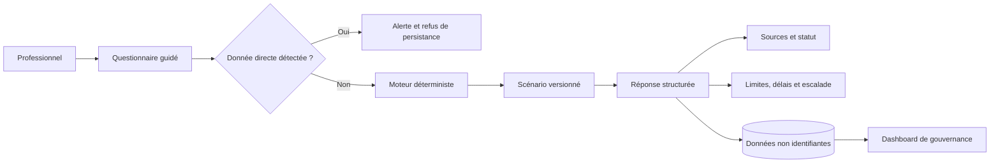

# Architecture

Clinical Navigator repose sur une application React, un serveur Express et des procédures tRPC typées. Le moteur d’orientation est déterministe : il rapproche les éléments généraux saisis d’un catalogue de scénarios versionnés, puis rend les actions, délais contextuels, acteurs, sources et limites explicites.

| Couche | Responsabilité | Limite principale |
|---|---|---|
| Client React | Parcours, recherche, outils, PWA et présentations accessibles. | Ne décide pas d’une conduite clinique ou réglementaire. |
| tRPC | Validation de forme, garde admin, accès authentifié et procédures métier. | Les données sensibles doivent être refusées avant persistance. |
| Moteur clinique | Priorisation, sélection de scénario, délais contextuels et limites. | Ne remplace pas la vérification du protocole, des SOP et de la juridiction. |
| Base de données | Préférences, cas génériques, feedback, backlog, versioning et métriques anonymes. | Aucun octet de document patient, document source ou donnée clinique ne doit y être enregistré. |
| Maintenance | Endpoint cron protégé pour vérification de liens. | Aucune modification automatique de statut ou publication réglementaire. |

Les contenus initiaux sont volontairement versionnés et dotés d’un statut explicite afin de ne pas présenter une information pédagogique, locale ou non revue comme une obligation universelle. Les principes de qualité ICH E6(R3) et les orientations de l’OMS constituent des références de départ, dont l’applicabilité doit être évaluée selon le contexte. [1] [2]

## Références

[1] [ICH, *E6(R3) Guideline for Good Clinical Practice*](https://database.ich.org/sites/default/files/ICH_E6%28R3%29_Step4_FinalGuideline_2025_0106.pdf)  
[2] [OMS, *Guidance for best practices for clinical trials*](https://www.who.int/publications/i/item/9789240097711)
